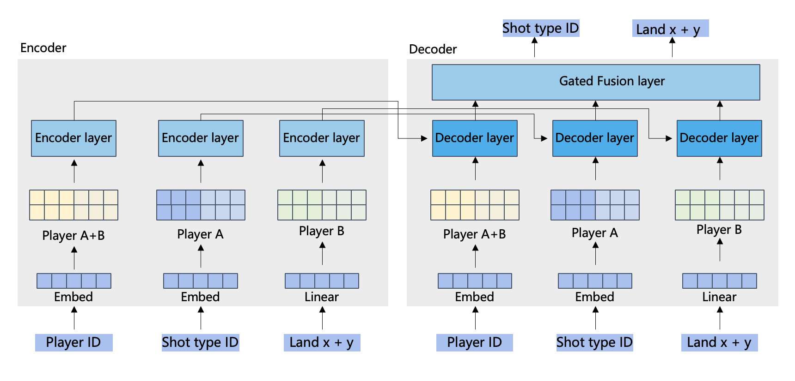

# CoachAI Badminton Challenge 2023 In conjunction with IJCAI



My code is heavily based on [ShuttleNet](https://github.com/wywyWang/CoachAI-Projects/tree/main/CoachAI-Challenge-IJCAI2023/Track%202%3A%20Stroke%20Forecasting), it achieves the 4th place overall and the best score for regression task of location prediction.


## How to use it

- prepare the data
- local train and evaluation
```shell
sh run.sh
```

- generate and submit
```shell
sh submit.sh
```
