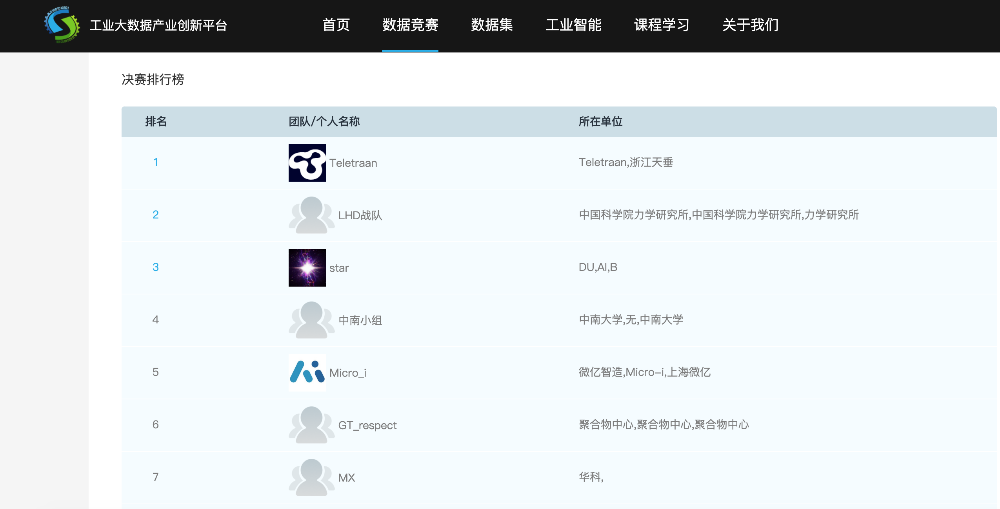

# 第四届工业大数据创新竞赛-注塑成型

Thank you for understanding that my code can't be shared as I participated this on behalf of my company.

<!--  -->

## Key of this competition:
- Solid understanding of data, feature and models are necessary
- Not a time series problem, but still need to consider the extrapolation problem for unknown scenario
- How to treat the uncertainty between local validation and LB, and how to choose one result as PB result

## Key of my solution:
- Create a custom feature from domain knowledge to evaluate the distribution difference between training and testing dataset
- Use linear regression model with above feature to modify the last novel batch's prediction result to align the test and train data
- Most important is I am lucky enough

## Personal gain
- A basic practice of GBDT and NN model
- No hurry to run an experiment, make sure every experiment is reproducible and recorded. Try to explain every change, and treat it like a real project
- It's a test of altitude during competition. Never give up until the last minute, trust myself and fight like a solider
- Still need to improve my presentation skill. I don't have opportunity to present something since I transferred to a ML engineer these 2 years. But you can find that I'm still excellent at PowerPoint making, because during 5 years of my last job @ Mercedes, my main work is doing PPT and present it.
