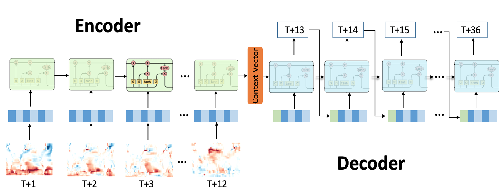

# 2021 AI Earth人工智能创新挑战赛-AI助力精准气象和海洋预测

<h1 align="center">

</h1><br>

## How to use it
1. Download the ENSO data from [tianchi](https://tianchi.aliyun.com/competition/entrance/531871/information), put it in `tcdata`
2. Train and inference
``` bash
# a single 42.61 model
cd code
sh run.sh
```

## Roadmap
- Af first, I try to practice LightGBM in time series, but its performance is not satisfied here.
- I optimized a [PyTorch baseline](https://tianchi.aliyun.com/forum/postDetail?spm=5176.12586969.1002.12.561d5330OkPrhZ&postId=176735). Then I decide to use TensorFlow, but my TF model only get 19 score with the same configuration.
- Then I turned back to time series model, I use a GRU seq2seq model modified from my [time series repository](https://github.com/LongxingTan/Time-series-prediction), it helps a lot.

## Other top solutions
- https://github.com/jerrywn121/TianChi_AIEarth
- https://github.com/icodeworld/AI-competition
- https://github.com/Wangjw6/Tianchi_Prediction
- https://tianchi.aliyun.com/notebook-ai/detail?spm=5176.12586969.1002.21.561d5330ApD1af&postId=196536

## Update
- I should win the 3rd place. The current 3rd team, from the host university, use lots of accounts to overfitting. [It's funny that they admitted it in comments here](https://www.zhihu.com/question/43573347/answer/1848496671).
