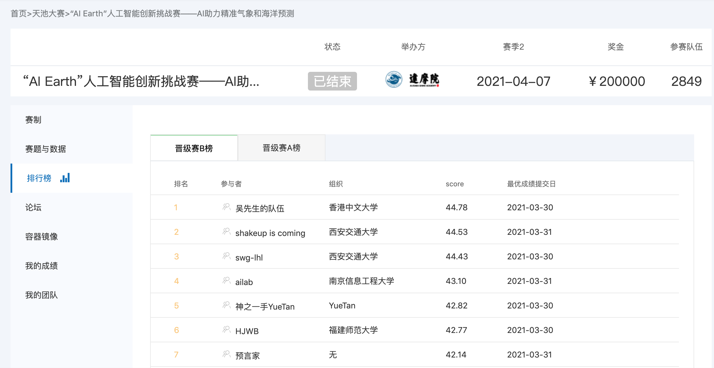

# 2021 “AI Earth”人工智能创新挑战赛-AI助力精准气象和海洋预测

<!--  -->

## How to use it
1. Download the ENSO data from [Tianchi](https://tianchi.aliyun.com/competition/entrance/531871/information), put it in `tcdata`
2. Train and inference (A single 42.61 model)
``` bash
cd code
sh run.sh
```

## Roadmap
- My wife was learning and interested in time series prediction at that time. So I found this competition.
- Af first, I thought I could practice LightGBM in time series, but it's wrong, my best LGB time series model got -20 score, but other guys have +20 in LB. So I guess time information is not the most important, I turned to deep learning to consider both spatial and temporal information.
- I trained a 22.7 PyTorch baseline and [open-source it](https://tianchi.aliyun.com/forum/postDetail?spm=5176.12586969.1002.12.561d5330OkPrhZ&postId=176735) in the forum. Then I decide to use TensorFlow, but my TF model only have 19 score. I optimized it for one week until I got a 23. The spring festival holiday is over, I spent the whole holiday on this.
- I don't have any progress for 2 weeks after vacation. I just changed some data sampling and random seed while free, no helps and dropped to 30th+. Then I turned back to time series model, I use a GRU seq2seq model modified from my [time series repository](https://github.com/LongxingTan/Time-series-prediction), it helps a lot. I end up with score 39.6 and 14th in LB
- The local validation and LB is quite different, so shake up is inevitable. But luckily, I was shook to a higher score after the data changed to PB. I guess it's due to I don't use complex spatial information, I guess it's hard to predict the next 24 months based on spatial data. For the temporal data, I only use the aggregated statistical information.
That's just my guess, maybe I'm just lucky as always
- We have another 7 days to tune the model in PB data, it's not good to have so many times to submit actually, it highly increases the probability to overfit the data. And the last three days I need to travel for business, and I don't have any better idea, so I don't have obvious progress. My rank dropped from 3rd to 5th. Tt's good to see the young guys are so aggressive and strong, the future is yours.


## Other fancy ideas
Note that most of them don't help, sad
- use 36 month to train a model, and then mask the first 24 months to zero and fine tune it
- predict the main component after Fourier transform, so reduce the 24 predict targets to 5. The NINO index is still like a wave, so use transform to capture the wave information
- I still think the knowledge from signal processing also helps this task, like PK-PK, PK, RMS
- use video prediction method to capture the feature from spatial temporal data, like TimeDistributed, ConvLSTM, MIM
- use natural language generation method like Bert to predict the future 24 month
- the online testing data is so small and repetitive, so most of the model is overfitting. I sampled 10 times from SODA data, use its mean metrics score as local test. It helps a little but not always
- the model I use is a combination of spatial-temporal model and time series model, but I guess, it's not possible to predict its future 24 months precisely using spatial information. But please know that time series model contribute 42.61 score, the spatial model contribute another 0.2 score


## Personal gain
- Good experience to finish a time series competition with deep learning
- I am not a climate expert, but some domain knowledge is always help. I use some features from domain materials.
- Another unstable competition that I can't find a good way to do local validation. But another acceptable result at last, my original target is Top20, or try Top10, I'm a little nervous when I'm in 30th+ for two weeks
- Use imagination to think a novel solution is an amazing trip for brain, like the above fancy ideas
- It's also a test for my [time series repository](https://github.com/LongxingTan/Time-series-prediction), and it proves my implementation doesn't have big issues. Next step is to complete it into a python package
- It always feels strange that some operation don't work, but after some changes, you try it again and it works. Or the opposite, the working operations don't work any more. Lots of results are uninterpretable for me, I still need to solid my foundation
- Due to deep learning is so dominant in this, so I need to find another normal time series competition to let my wife practice it

## Learn from other teams
- Think more about target of the project, some teams don't predict NINO3.4 index directly, but to predict the interested region's SST to calculate it
- Pay more attention to the model optimization from latest papers and try more. So it's better to have a detailed plan, when to focus on data and feature, and when to focus on model.

