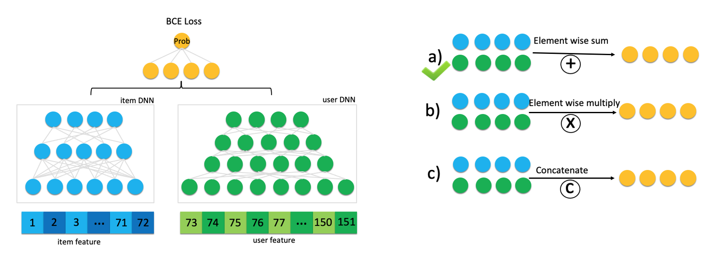

# 第三届 Apache Flink 极客挑战赛暨AAIG CUP-电商推荐抱大腿攻击识别

<h1 align="center">

</h1><br>


## How to use it
1. Download the [data](https://tianchi.aliyun.com/competition/entrance/531925/information), put it in tcdata folder
2. Train and inference

```
# In container terminal, train and online predict
export SGX_MODE=SIM
sh run.sh
```
3. The host provides a helpful pipeline. If you are only interested in the NN model part, you could refer to [here](https://github.com/LongxingTan/Data-competitions/tree/master/tianchi-flink-aaig/root/tianchi_aiflow/workflows/tianchi_main/tf_main.py). 


## Other top solutions
- https://github.com/rickyxume/TianChi_RecSys_AntiSpam
